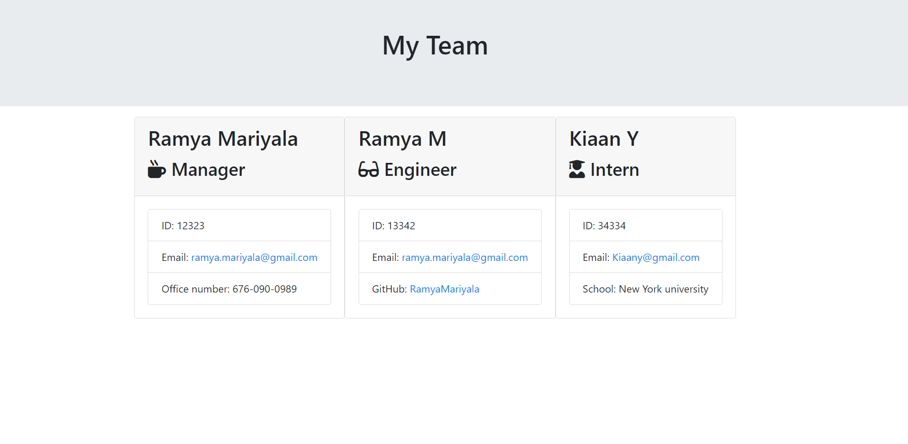
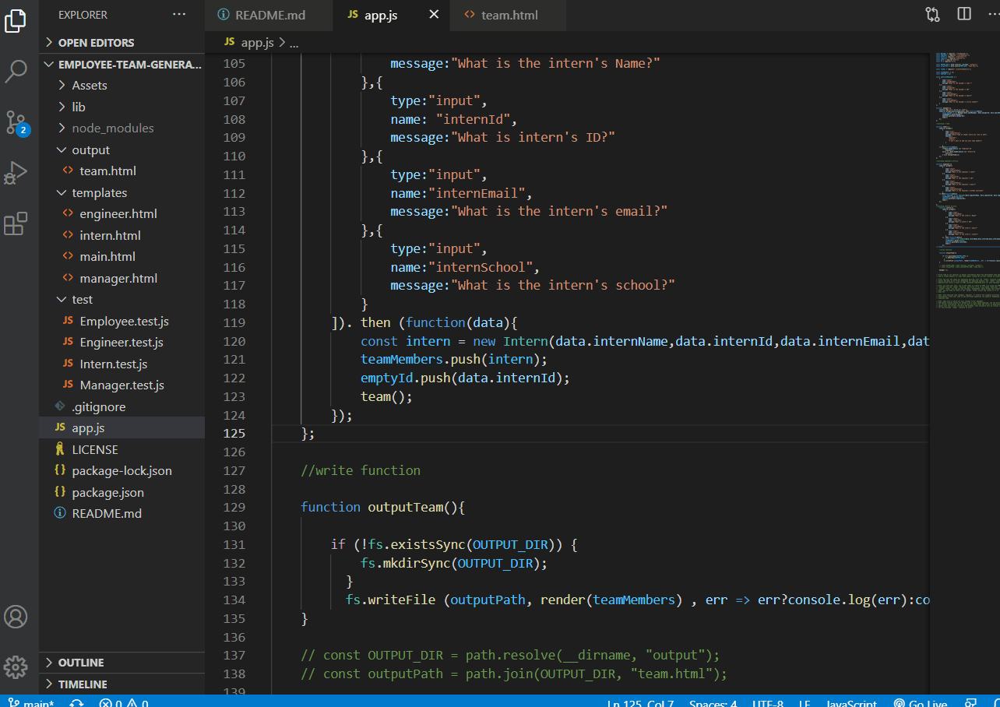

# employee-team-generator

# User Story
As a web developer, I want to be able to build a Node CLI that takes in information about employees and generates an HTML webpage that displays summaries for each person.

# Table of Content
Description
Requirements
Screenshots
Link to Application functionality
Tools

# Description
Build a software engineering team generator command line application. The application will prompt the user for information about the team manager and then information about the team members. The user can input any number of team members, and they may be a mix of engineers and interns. This assignment must also pass all unit tests. When the user has completed building the team, the application will create an HTML file that displays a nicely formatted team roster based on the information provided by the user.

# Requirements
Use the Inquirer npm package to prompt the user for their email, id, and specific information based on their role with the company.

A manager should also enter office number, an intern should input their school name, and an engineer should provide their GitHub username.

The app runs as a Node CLI to gather information about each employee.

# Deployed link # Github link
[Deployedlink](https://ramyamariyala.github.io/employee-team-generator/)
[Github](https://github.com/Ramyamariyala/employee-team-generator.git)

# Screenshots

# GIF 

## Questions
For questions, please contacte me:
* [Ramya Mariyala] (https://github.com/Ramya Mariyala)
* Email: ramya.mariyala@gmail.com

